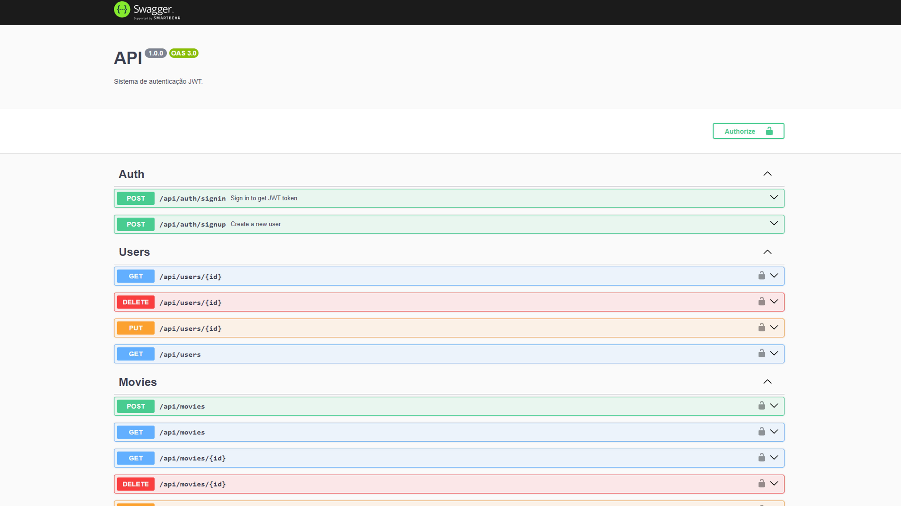

# API Documentation

## Image Preview



## Overview

This API is built using Nest.js and incorporates various technologies such as TypeORM for database interactions, JWT for authentication, Swagger for API documentation, and Docker for containerization.

## Installation

To get started with the API locally, follow these steps:

1. Clone this repository.
2. Navigate to the project directory.
3. Install dependencies using pnpm:

````bash
$ pnpm install

## Description

The API was built with the intention of learning Nest.js, SOLID principles, and Clean Architecture.

## Instalation and running the app locally

```bash
$ pnpm install


## Description

## Instalation and running the app locally

```bash
$ pnpm install
````

## Running the app

```bash
# development
$ pnpm run start

# watch mode
$ pnpm run start:dev

# production mode
$ pnpm run start:prod
```

## Test

```bash
# unit tests
$ pnpm run test

# e2e tests
$ pnpm run test:e2e

# test coverage
$ pnpm run test:cov
```

## Running with docker

To run the application with docker, first you need to deactivate postgresql if it's activated, then run the following commands:

# to run docker-compose

```bash
$ docker-compose up -d
```

You can access the API at localhost:3000 and the documentation at localhost:3000/api.

## Technologies

- TypeScript
- Nest.js
- TypeORM
- JWT
- Swagger
- Docker
- Redis
- Postgresql

## Experience

- JavaScript - 18 months.
- TypeScript - 1 year.
- NodeJs - 1 year.
- Postgresql - 1 year.
- JWT - 1 year.
- Docker - 8 months.
- Nest.js - 2 months.
- TypeORM - 2 months.
- PrismaORM - 8 months.
- Swagger - 1 months.
- Redis - First project.
- NextJS - 1 Year.
- ReactJS - 14 months.
- VueJS - 8 months.
- TailwindCSS - 8 months
